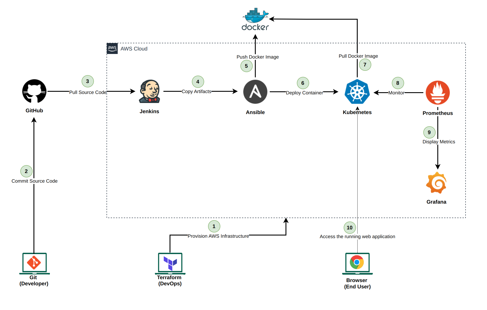

## ABC Technologies source code

### Introduction

This is the source code of my Edureka - Perdue Post Graduate Program in DevOps Industry Grade Project. It contains all the code required to deploy the sample application that is used for the project. Bellow is the architectural diagram of the solution we want to implement.


*The project's complete DevOps Architecture*

### Project structure

The project contains the following components :

- `assets`: the folder that contains the architectural diagram of the solution we are going to implement.
- `k8s`: the folder that contains all the ressources that will be deployed in kubernetes (the application itself and the monitoring solution). One should notice that all the monitoring source code is based on an example we worked on in the course. This folder contains 2 main files (`k8s/deployment.yml` and `k8s/service.yml`) which the main kubernetes artifacts for deploying the application. 
- `src`: this folder contains the complete source code of the application. This source code has been provided to us like the starting point of the DevOps project.
- `Dockerfile`: this file contains directives for docker image generation.
- `Jenkinsfile`: this file contains the complete CI/CD that will **compile, test, package** and **hands the packages artifacts to ansible**.
- `pom.xml`: this is the main maven configuration file for the java project.
- `abc-tech-playbook.yml`: this is the ansible playbook that will build the docker image of the project, push it to docker hub, then deploy the project on kubernetes. 

### Deploying the application

To deploy the solution, the following steps should be executed:

#### Create the infrastructure of the project

The targeted platform for the project is AWS, so to have all the project created (the Jenkins and Ansible servers, then the EKS cluster) we need to run the [Infrastructure project for ABC Technologies](https://github.com/Simoganger/edureka-perdue-infra). The project contains a `README.md` file that give the details on how to run the project.

#### Ansible server configuration

After creating all the resources properly, the first step will be to complete the configuration of the Ansible server. This will be done by following these steps :

Connect to your AWS account where the resources have been created.

Connect to the instance named **Ansible Server**

Rename the server to *ansible-server* using the following commands:

```
sudo su -
nano /etc/hostname
    > ansible-server
init 6
```

Create a new user and set his password

```
sudo su -
useradd ansadmin
passwd ansadmin
```

Add the new user to sudoers group
```
visudo
    > ansadmin ALL=(ALL)    NOPASSWD: ALL
```
Enable password based authentication for this use and reload sshd service

```
nano /etc/ssh/sshd_config
# PasswordAuthentication no
PasswordAuthentication no
service sshd reload
```
Create keys for ansadmin user
```
sudo su - ansadmin
ssh-keygen
```
Edit ansible hosts file to add the ansible-server itself as host. Replace the *ANSIBLE_PRIVATE_IP_ADDRESS* by what ever yours is after terraform execution.
```
sudo mkdir /etc/ansible
nano /etc/ansible/hosts
    [ansible]
    <ANSIBLE_PRIVATE_IP_ADDRESS>
```
Copy the ssh key to this same server
```
cd .ssh
ssh-copy-id <ANSIBLE_PRIVATE_IP_ADDRESS>
```
Test ansible server connection to hosts
```
ansible all -m ping
```
Create a work directory for ansible (we assumed we are still connected with *ansadmin* user) and assign the directory to the ansible user
```
cd /opt
sudo mkdir docker
sudo chown ansadmin:ansadmin docker
```

Add ansadmin to the docker group
```
sudo usermod -aG docker ansadmin
```
Restart the docker service
```
sudo service docker restart
```
Login to docker hub to have the credentials stored. You need to have an account created on [docker hub](https://hub.docker.com/).

```
docker login
username:
password:
```
Configure access to the EKS cluster
```
aws eks update-kubeconfig --name devl --region us-east-2
```

Test access to the eks cluster by running the following command that will display the nodes of the eks cluster.
```
kubectl get nodes
```


#### Jenkins server configuration

#### Monitoring solution configuration

